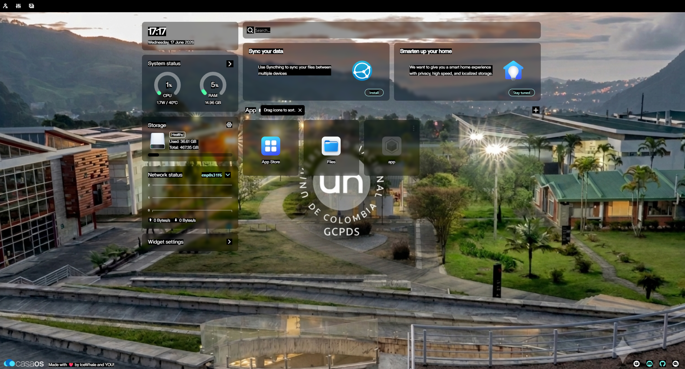
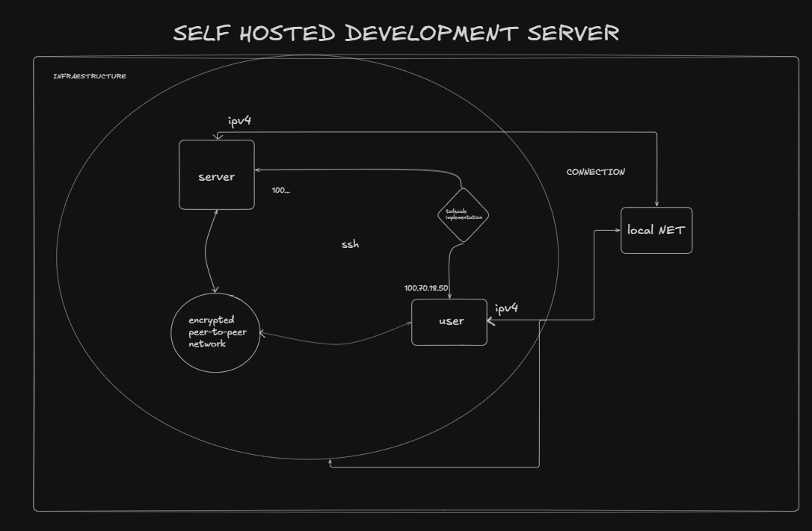
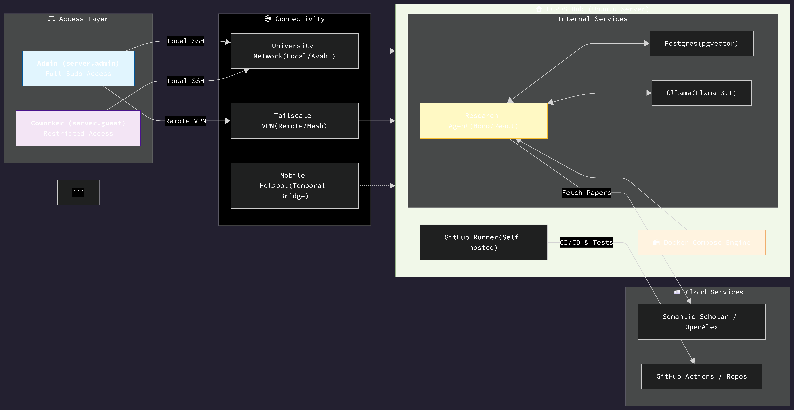
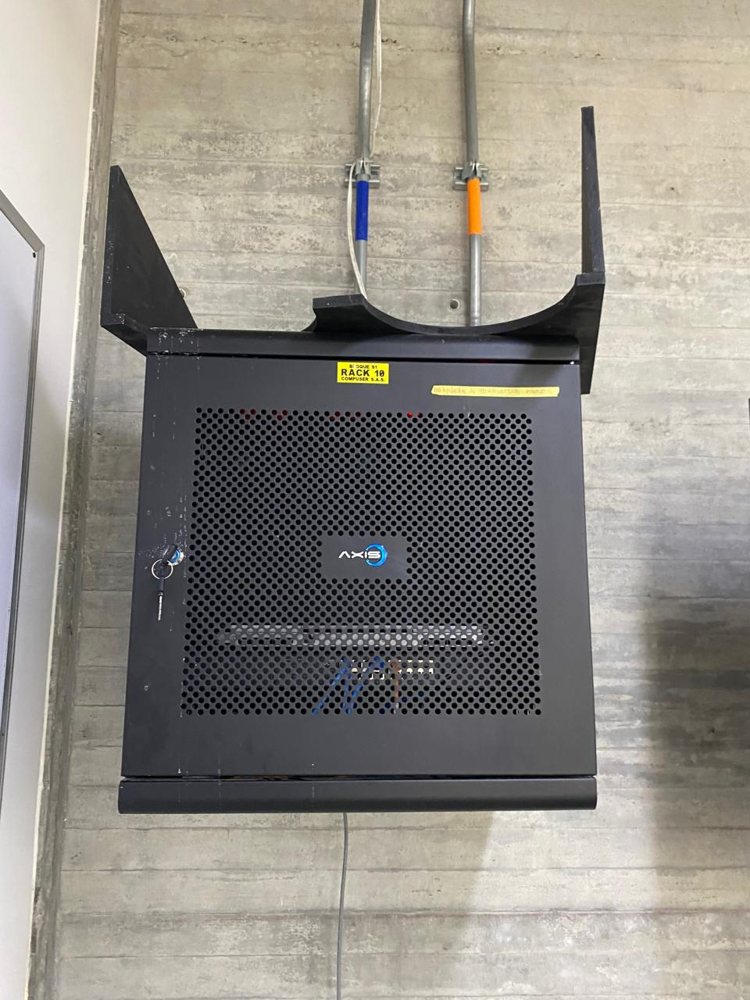

# GCPDS Research Hub


Welcome to the **GCPDS Research Hub**, a high-performance development environment and AI-powered research assistant designed for autonomous literature review and automated deployment.

- Follow a self-hosted research infrastructure designed to provide:

    - Secure remote infrastructure management 

    - Automated software deployment and operations (CI/CD)

    - AI-powered research acceleration through autonomous agents

---


_CASA OS DASHBOARD_




---

##  Project Genesis & Design Phases

This server was built following a rigorous 6-phase infrastructure plan. We transitioned from a standard Desktop PC to a professional-grade research server by offloading heavy computational tasks to a dedicated self-hosted environment.

> **Design History:** For a detailed breakdown of the hardware setup, OS configuration, and AI stack implementation, see the [**INFRASTRUCTURE PLAN FOLLOWED**](INFRASTRUCTURE_PLAN.md).

---

##  The Innovation: Why Self-Hosted?

The **Research Accelerant Hub** represents a shift from local processing to a centralized "Research Engine":
- **Computational Offloading:** Moves heavy AI tasks (Ollama/Llama 3.1) and PDF indexing to dedicated server hardware.
- **24/7 Autonomous Pipeline:** Research sessions run in the background without needing your laptop open.
- **Secure Global Access:** Leveraging **Tailscale** to bypass complex network restrictions, providing a seamless "local" experience from anywhere.
- **Persistent API Deployment:** The core research API (Hono + tRPC) is containerized via **Docker** and bound to port **3000** of the server's IPv4 address. This transforms the tool from a local `npm run dev` script into a resilient, always-on academic utility.
- **Dockerized Architecture:** Ensures consistent environments across development and production, eliminating "it works on my machine" issues.

---

##  Innovation & Management Tool

The core engine of this hub is the _Research Accelerant Agent_. To get started, follow this **[detailed guide](howToUse.md)**, which walks you through setup, usage, and best practices.

This tool serves as the primary innovation layer, providing:
- **Autonomous Orchestration:** Automates the end-to-end research pipeline directly from the server.
- **Centralized Management:** A single, Dockerized interface for all academic and data operations.
- **Enhanced Understanding:** Deeply integrates with the server's infrastructure to provide AI-driven insights.

For the full technical breakdown and development updates, visit the official repository:
👉 [**GitHub: Macreat/ResearchAccelerantAgent**](https://github.com/macreat/ResearchAccelerantAgent)

---

##  Quick Access Dashboards

Access these links when connected to the **University Network** or **Tailscale**:

| Service | Local/IP Link | Remote (Tailscale) | Purpose |
| :--- | :--- | :--- | :--- |
| **CasaOS Dashboard** | [http://192.168.0.136](http://192.168.0.104) | [http://100.70.18.50](http://100.70.18.50) | **Storage & Management:** Set up files, manage the Data Lake, and monitor server hardware. |
| **Research Agent UI** | [http://192.168.0.136:3000](http://192.168.0.104:3000) | [http://100.70.18.50:3000](http://100.70.18.50:3000) | **API Research Tool:** Execute academic pipelines, AI synthesis, and document generation. |

###  Which link should I use?
- **Local/IP Link:** Use this when you are on the same WiFi/Ethernet as the server. It is faster and has zero latency.
- **Remote (Tailscale):** Use this when you are working from home or when the University network restricts local discovery. It provides a secure, encrypted tunnel to your hub from anywhere in the world.
- **Pro Tip:** If Avahi is active on your machine, use `http://local.local` to find the server automatically even if the IP changes.


### Personalize ssh config : 

copy this into your .ssh/config file: 


 
```bash

Host server.cow
    HostName 192.168.0.136
    User coworker
    IdentityFile ~/.ssh/id_created; where id_created its a key generated. 

```
---
## Infrastructure & Connectivity

The server is designed to operate within complex networking environments (like University campuses) using a hybrid access model.



### 1. The University Network (Local Access)
The server connects to the University WiFi/Ethernet. 
- **Local Discovery:** Uses `Avahi-daemon` for `.local` resolution.
- **Direct SSH:** Access via `ssh server.admin` or `ssh server.coworker` when on the same network.
- **Resilience:** If the network restricts external VPNs, local SSH remains the primary low-latency connection.

### 2. Hybrid Remote Control (Tailscale & Hotspots)
For work outside the lab or when University ports are blocked:
- **Tailscale:** A secure mesh VPN that bypasses NAT and firewalls, allowing you to access the Agent and your files from anywhere in the world.
- **Temporal Hotspots:** The server supports connection via mobile hotspots as a "Bridge" for initial setup or remote maintenance when primary WiFi is unavailable.


### Connectivity 




---


##  User Credentials

Access is currently restricted to two primary user profiles:

| User Profile | Username | Access Level |
| :--- | :--- | :--- |
| **Admin** | `serveradmin` | Full `sudo` and system management. |
| **Guest/Coworker**| `coworker` | Standard access (cannot update system). |

---


## Phyisical device 

_current physical place_ : located at _National University of Colombia – Manizales Campus (La Nubia), Building S1, GCPDS, Level 1, Image Processing and Machine Vision Laboratory._   



*Maintained by the GCPDS Team. v0.2-1.0 Prototype Stable.*

